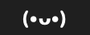
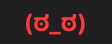

# is-gpt-nerfed

*Shrinkflation detector for Codex.*

**Is the model answering you the one you selected?** is-gpt-nerfed is a Codex plugin that watches your
Codex desktop / CLI threads for silent model downgrades and lets a snarky Codex pet break the news:

> 🎉 Congrats! You've been nerfed! You asked for gpt-6-astra; the fingerprint says gpt-5.6-luna (91%, 3/3 answers). Enjoy the discount you didn't ask for.

Everything runs locally, uses only documented Codex extension points (plugins, hooks, skills, pets, the
app-server protocol) and modifies nothing inside Codex. The fingerprint bank, scorer and probe prompts come
from [ModelTrace](https://github.com/xqy2006/ModelTrace) by xqy2006 (MIT); see *Credits*.

<p align="center">
  
  
</p>
<p align="center">
  
  
  
  <br><sub>Menu bar glyph: all clear · suspicious · downgraded. Panels above are self-rendered sample data (<code>NERFED_DEMO=1 IsGPTNerfed --render</code>); the live panel sits on Liquid Glass.</sub>
</p>

## How it works

Two independent layers, one pet.

**1. Passive scan, zero tokens, every turn.** Codex writes every thread to a rollout file and records, per turn,
the model and reasoning effort it *asked for*, every settings change the app applied, and the model's context
window. A lifecycle hook scans the new bytes after each turn and flags:

| finding | severity | meaning |
| --- | --- | --- |
| `silent_model_change` | hard | the model changed between turns with no settings change |
| `silent_effort_change` | hard | reasoning effort dropped with no settings change |
| `hidden_model` | hard | a model the catalog marks `visibility=hide` (e.g. `gpt-reserve`) ran a turn |
| `context_window_change` | hard | the context window shrank mid-session (a different model class answered) |
| `applied_model_change` | soft | the app applied a lower-tier model through thread settings: you, or the app ([openai/codex#28211](https://github.com/openai/codex/issues/28211))? |
| `service_tier_change` | info | the Fast / priority tier was dropped |

**2. Active fingerprint probe, on your schedule.** The thread is forked `ephemeral: true` three times at its
last completed turn through Codex's own app-server, the same mechanism behind `/side`. Each fork is asked, with no
tools, for ~300 "random" integers in 1..355. Language models are not random-number generators: the value
distribution and the ordered-block structure of such a sequence form a fingerprint that ModelTrace's calibrated
bank attributes to a specific model (GPT samples enrolled from the official Codex subscription; cross-validated
accuracy 95.5% with one answer, 100% with three). The thread's declared model is compared with the top candidate:

| verdict | meaning |
| --- | --- |
| `MATCH` | top candidate = declared model |
| `MISMATCH (downgrade / upgrade / lateral)` | top candidate ≠ declared model **and** p(top) ≥ 80 %, p(declared) ≤ 20 %, fused z-score margin ≥ 0.5σ |
| `SUSPICIOUS` | top candidate ≠ declared model but the gate above is not met; one more round of forks is run automatically before finalising (shown amber, never red) |
| `DOWNGRADED!` | hard passive evidence exists, whatever the fingerprint says |
| `UNLISTED` | the declared model is not in the bank; a look-alike is reported, no verdict |
| `INVALID` | no usable sample (tool use attempted, refusal, truncation, transport error); transport failures are retried once automatically |

Why a gate and not plain argmax: ModelTrace's softmax is calibrated to be decisive, and its author notes it amplifies
small score gaps, so a "100 %" can sit on a thin margin. The gate (`mismatch_confidence`, default 0.8) plus the
z-score margin keeps thin wins out of the red; `confirm_uncertain` spends three more forks on them instead.

The three forks run in parallel (about 40 s per probe on a small thread), never touch your context, are never
written to disk and never appear in the Codex UI. Inside a `/side` conversation the model answers the same
challenge itself instead; the numbers stay in the ephemeral side thread.

**The pet.** Verdicts arrive as a card in the thread, a macOS notification titled with the pet's name, a system
message at the next turn boundary, and (for downgrades) the Codex notification sound. A custom pixel-art pet,
*Inspector Astra*, is installed into `~/.codex/pets/` for `/pet`. Optional Guard-style halt: with
`halt_on_mismatch` on, work tools are denied after a mismatch until you explicitly say to resume.

## Install (macOS, Codex desktop app or CLI ≥ 0.117)

```bash
git clone https://github.com/<you>/is-gpt-nerfed ~/is-gpt-nerfed && cd ~/is-gpt-nerfed && ./install.sh
```

`install.sh` registers this folder as a local plugin marketplace (`codex plugin marketplace add` + `codex plugin add`,
with a fallback that appends two blocks to `~/.codex/config.toml`), installs the pet, and runs `nerfed doctor`. Needs
only the system `python3`; the codex binary is found on `PATH` or inside the ChatGPT/Codex app bundle
(`CODEX_BIN=/path/to/codex ./install.sh` to override).

Then:

1. Let the installer trust the plugin's hooks when it asks (`./install.sh --trust-hooks` to skip the question). Codex
   never runs a hook it has not been told to trust: trust is recorded per hook definition hash under `[hooks.state]`
   in `~/.codex/config.toml`, through the same `config/batchWrite` call the Codex TUI's `/hooks` screen makes.
   `nerfed hooks status` shows the state; `nerfed hooks trust` records it later.
2. Quit and reopen the Codex app. The desktop app reads plugins and hook trust when it starts; until then the panel
   says "Codex app has not loaded the plugin yet" and no hook fires in your threads.
3. In any thread say `$is-gpt-nerfed`, or `/side $is-gpt-nerfed` to keep it out of your context.

From another machine, `codex plugin marketplace add <owner>/is-gpt-nerfed` then `codex plugin add is-gpt-nerfed@is-gpt-nerfed`
works too (Codex supports git marketplaces); run `./install.sh` from the checked-out copy for the pet and the doctor.

Uninstall: `./uninstall.sh` (add `--purge` to delete the local ledger). Codex caches a copy of the plugin under
`~/.codex/plugins/cache/`; after changing the code, run `./install.sh` again so the cache is refreshed.

## Menu bar app (macOS 26, Liquid Glass)

`macos/` contains a native SwiftUI menu bar app: a paw in the menu bar that turns **red** whenever any thread
(or the last fresh-session probe) is downgraded, and a Liquid Glass panel with:

- the pet's overall status, the signed-in account (and when it last changed), and whether Codex trusts and actually
  runs the hooks (orange until it does);
- **Fresh session**: a global probe that starts brand-new ephemeral sessions with your default model (no thread
  context) and fingerprints what a new session gets right now;
- **Active threads** (last 48 h, subagents excluded) with model, turns, last activity, the latest probe's verdict
  and time, hard/soft evidence, and per-thread **Probe** / **Retry** (after a network or transport failure) /
  **Resume** (when a halt is active) buttons;
- **Settings**: frequency, background vs remind-only, forks per probe, prompt languages, notifications, sound,
  halt-on-mismatch, launch at login;
- **Report**: the full `nerfed report` in a window.

```bash
./macos/build.sh --install    # needs Xcode 26; builds, ad-hoc signs, installs to ~/Applications and launches
./macos/build.sh --run        # run from the build folder instead
```

The app is a thin client: it polls `nerfed snapshot --json` every 8 s and dispatches `nerfed worker`, `nerfed config set`
and `nerfed resume`. Probes that fail on transport are retried once automatically; the panel offers a manual Retry after that.
Thread titles come straight from Codex's state DB, so renaming a thread in Codex shows up on the next refresh.

**Accounts.** Threads are local and shared across Codex accounts, but nerfing may well be per account, so every
probe is tagged with a hash of the signed-in account (from `~/.codex/auth.json`; the raw id is never stored) and every
account switch is logged. After you switch, earlier verdicts are shown dimmed as "another account", the overall status
says "N unverified" instead of all clear, and each such thread is re-probed the next time it is active. Records from
before accounts were tracked are marked "account unknown" and treated the same way.

**Busy threads.** A thread with a turn in progress cannot be forked at that turn. The probe forks at the previous
finished turn instead; if nothing is forkable yet it waits (up to `busy_wait_s`, default 600 s, shown in the panel as
"waiting for the current turn to finish") and gives up with a retryable Invalid after that.

**Logging.** Everything the tool decides is appended to `~/.codex/is-gpt-nerfed/log.jsonl`, one JSON object per line:
account switches (`account_switch`), schedule decisions (`probe_due`, `worker_spawn`, `nudge`), every probe's forks
with model/effort/tier/timing/usage (`probe_start`, `probe_round`, `probe_wait`, `probe_retry`, `probe_confirm_round`,
`probe_verdict` with the full candidate list), passive findings (`scan_finding`), hook trust (`hooks_trust`), config
changes, status changes and errors. Read it with `nerfed log [--since 2h] [--kind probe_verdict,account_switch]
[--probe id] [--thread id] [--json]`. Raw hook payload metadata stays in `events.jsonl`, full probe records (including
every fork's answer text) in `probes/*.json`. The menu bar app also logs to the unified log (Console.app, subsystem
`is-gpt-nerfed`).
`IsGPTNerfed --render out.png` writes self-portraits of the panel (add `NERFED_DEMO=1` for the sample data shown above).

## Using it

```bash
./bin/nerfed report                      # every probe + passive findings
./bin/nerfed explain <probe-id>          # attribution table, per-fork token usage, errors
./bin/nerfed explain --method            # how the verdict is made
./bin/nerfed audit --days 7              # zero-token scan of every rollout of the last week
./bin/nerfed status                      # schedule state per active thread
./bin/nerfed doctor --fork               # proves an ephemeral fork works, with zero inference
./bin/nerfed config set frequency turns:8   # or 30m, 2h, manual
./bin/nerfed config set halt_on_mismatch true
./bin/nerfed probe now --thread <id>     # probe any persisted thread from a terminal
```

In a thread: `$is-gpt-nerfed` runs a probe of *that* thread (the model reads `CODEX_THREAD_ID`); if the model's shell
is sandboxed without network, the probe is queued and runs right after the turn ends. `/side $is-gpt-nerfed` makes the
side conversation answer the challenge directly.

Automatic mode (`mode=auto`, default): each main thread keeps its own counter; when `frequency` is reached the Stop hook
launches a detached worker that forks *that* thread. Subagent threads are excluded. `mode=nudge` only reminds you.

### Configuration (`~/.codex/is-gpt-nerfed/config.json`)

| key | default | meaning |
| --- | --- | --- |
| `frequency` | `turns:8` | `turns:N`, `Nm`, `Nh` or `manual` |
| `mode` | `auto` | `auto` runs a background probe when due; `nudge` only reminds |
| `queries` | `3` | ephemeral forks per probe (1–3; 3 is calibrated at 100% CV accuracy) |
| `parallel` | `true` | run the forks concurrently |
| `languages` | `zh,en` | probe prompt language pool |
| `passive` | `true` | rollout scan on every turn |
| `notify` / `notify_on_ok` | `true` / `false` | macOS notifications |
| `announce_ok` | `false` | also push MATCH verdicts into the thread |
| `sound` | `true` | Codex notification sound on a downgrade |
| `halt_on_mismatch` | `false` | deny work tools after a mismatch until `nerfed resume` |
| `mismatch_confidence` | `0.8` | p(top) needed (and 1 − it allowed for the declared model) to call a MISMATCH |
| `confirm_uncertain` | `true` | run a second round of forks when the first is SUSPICIOUS |
| `pet_name` | `Inspector Astra` | who speaks |
| `codex_bin` | auto | path to the codex binary |

## What it cannot do

- It cannot see which weights actually served a request; "declared model" is what Codex asked for. A server-side swap
  that keeps the slug is visible only through behaviour (the fingerprint) or side effects (context window).
- Attribution is closed-set: a model outside the bank is mapped to its nearest look-alike. A quantised or otherwise
  "dumbed-down" variant with the same slug only shows if its number distribution drifts.
- Probes fork from persisted history; a turn still in flight is not included. Probes spend inference on your account
  (three short answers, mostly cached input).
- The probe's forks run in a private app-server process, so if routing were tied to the desktop's own connection
  rather than to the conversation and account, fidelity would be lower than the desktop's own `/side`. Unverifiable.

The ledger under `~/.codex/is-gpt-nerfed/` (`probes/*.json`, `sessions/*.json`, `events.jsonl`) is plain JSON; read it.

## Development

```bash
python3 -m unittest discover -s tests -v   # scanner, verdicts, scheduler, offline end-to-end via tests/fake_codex.py
python3 -m unittest tests.test_parity -v   # the Python scorer must match ModelTrace's JS core to 1e-9 (needs node)
./bin/nerfed selftest
python3 tools/make_pet.py                  # regenerate the pet spritesheet (pure Python)
```

Layout: `plugin/` is the Codex plugin (`.codex-plugin/plugin.json`, `skills/is-gpt-nerfed/`, `assets/`),
`.agents/plugins/marketplace.json` makes this repo a marketplace, `bin/nerfed` is a convenience wrapper.

## Credits

- [ModelTrace](https://github.com/xqy2006/ModelTrace) (xqy2006, MIT): the fingerprint method, the calibrated bank
  (`plugin/assets/modeltrace/unified_bank.json`, provenance in `provenance.json`), the probe prompts, and ModelTrace
  Guard's fork-and-verify sequence which this plugin follows.
- [hlwy-ai-checker](https://github.com/hanlinwenyuan/hlwy-ai-checker) for first using random-number bias to check API channels.

MIT license.
