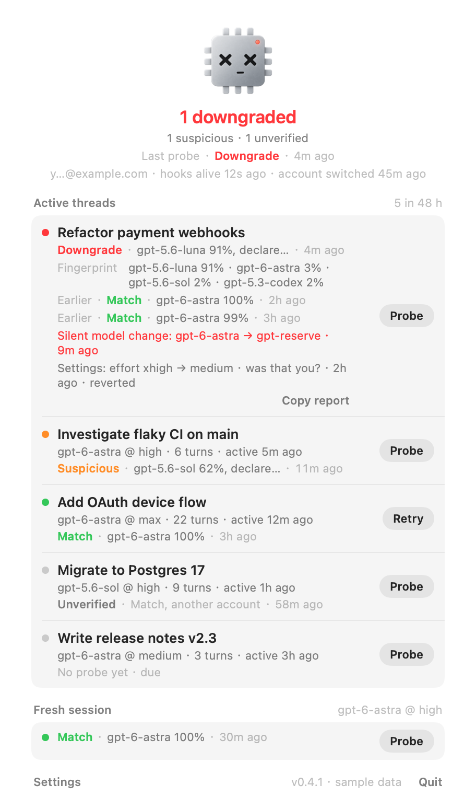

<p align="center"></p>

<p align="center"></p>

You pick a model in Codex. This tells you whether that model is actually the one answering, and says so when it isn't:

> 🎉 Congrats! You've been nerfed! You asked for gpt-6-astra; the fingerprint says gpt-5.6-luna (91%). Enjoy the discount you didn't ask for.

<p align="center">
  
  
  
  <br><sub>The panel · a session opened in place · Settings</sub>
</p>
<p align="center">
    
  <br><sub>All clear · Suspicious · Nerfed</sub>
</p>

## What it checks

Two signals. Everything runs on your Mac; nothing is uploaded.

**Every turn, zero tokens.** Codex records, per turn, which model and reasoning effort it asked for. The plugin
reads that and flags anything that changed without you changing it: a model swap, a reasoning-effort drop, a hidden
internal model (such as `gpt-reserve`), a context window that shrank. A move to a newer or larger model (a rollout)
is reported too, as good news.

**On a schedule, three forks.** The session is forked ephemerally three times at its last finished turn, the same
mechanism as `/side`, invisible in Codex. Each fork is asked for about 300 "random" numbers. Models are bad at
random, each in its own way, and [ModelTrace](https://github.com/xqy2006/ModelTrace)'s calibrated bank turns that
into a fingerprint (100 % accuracy with three answers in cross-validation). The verdict compares the fingerprint with
the model you selected:

| verdict | meaning |
| --- | --- |
| Match | the model you selected answered |
| Suspicious | the fingerprint leans elsewhere, not confidently; it stands until the next probe |
| Downgrade / Upgrade / Rerouted | confident mismatch: top candidate ≥ 80 %, your model ≤ 20 % |
| Downgraded | Codex's own records show a silent switch; no fingerprint needed |
| Upgraded | Codex's own records show a move to a newer or larger model (a rollout); good news |
| Unlisted | your model is not in the fingerprint bank yet |
| Invalid | no usable answer (tool use, refusal, network); not a verdict: the row keeps its last one and offers Retry |

A mismatch reaches you as a macOS notification, a message in the session, and a red face in the menu bar.
Match is silent.

## Install

**App, macOS 26.** One line in Terminal installs the latest release and opens it:

```bash
curl -fsSL https://raw.githubusercontent.com/kiyoakii/is-gpt-nerfed/main/install-app.sh | sh
```

Or download the disk image from [Releases](https://github.com/kiyoakii/is-gpt-nerfed/releases) and drag IsGPTNerfed to
Applications; the app is not notarized yet, so macOS blocks that first launch until you allow it under System
Settings → Privacy & Security.

Then click the face in the menu bar and press **Install**: that registers the bundled plugin with Codex and trusts
its hooks. When a newer release is out, the panel's footer says so and a notification arrives once; click it and the
app downloads the new build, checks its checksum, replaces itself and relaunches.

**Without the app, any macOS.**

```bash
git clone https://github.com/kiyoakii/is-gpt-nerfed ~/is-gpt-nerfed && cd ~/is-gpt-nerfed && ./install.sh
```

Say yes when it asks to trust the hooks: Codex runs no hook you have not trusted, and it does not tell you.

Needs a Codex with plugin hooks (desktop app or CLI; tested on 0.154) and the system `python3`. Uninstall with `./uninstall.sh`.

## Using it

- **Nothing.** Every session you work in is probed in the background after 30 minutes of activity.
- **`$is-gpt-nerfed`** in a session probes it now.
- **Menu bar.** Sessions of the last 48 hours with their last verdict; click one for its report (fingerprint, earlier
  probes, evidence), right-click for actions. Probe and Retry per session, and *Fresh session*: what a brand-new
  session gets right now.
- **Terminal.** `nerfed probe now` (pick a session), `nerfed report`, `nerfed explain <probe>`, `nerfed log --since 2h`.

Settings live in the app, or `nerfed config set <key> <value>`:

| key | default | |
| --- | --- | --- |
| `frequency` | `30m` | per session: every N minutes of activity (`30m`) or every N turns (`turns:8`) |
| `fresh_frequency` | `manual` | probe a brand-new session every N minutes, whatever you are doing |
| `mode` | `auto` | `auto` probes in the background, `nudge` only reminds you |
| `halt_on_mismatch` | `false` | block tools after a mismatch until you say resume |
| `notify_on_ok`, `announce_ok` | `false` | also report Match |
| `hide_titles` | `false` | screenshot mode: neutral session names, no account |
| `check_updates` | `true` | ask GitHub for a newer release every 10 minutes |

## Accounts

Sessions are shared between Codex accounts; nerfing may not be. Every probe is tagged with the signed-in account (a
hash, never the id). After you switch accounts, older verdicts show as "another account" and those sessions are
probed again.

## Limits

- "The model you selected" is what Codex asked for. If the server swapped weights and kept the name, only the
  fingerprint or a shrinking context window can show it.
- The bank is closed-set: a model outside it is mapped to its nearest look-alike.
- A probe costs three short answers on your account.
- A model or effort change made through Codex's own settings is shown as a question ("was that you?"): the
  plugin cannot tell whether you or Codex changed it.
- The forks run through a private connection to Codex's app-server, not through the desktop app's own.

## Privacy

Reads `~/.codex` (session records, models cache; `auth.json` only for an account hash and a masked e-mail). Writes
`~/.codex/is-gpt-nerfed` (probes, verdicts, `log.jsonl`). The forks are ordinary Codex inference under your account.
The only network request of its own is one to GitHub every ten minutes for the latest release tag, while the app is
open; switch it off in Settings and it makes none.

## Credits

[ModelTrace](https://github.com/xqy2006/ModelTrace) (xqy2006, MIT) for the fingerprint bank, scorer, prompts and the
fork-and-verify sequence; [hlwy-ai-checker](https://github.com/hanlinwenyuan/hlwy-ai-checker) for the random-number
idea; [simple-term-menu](https://github.com/IngoMeyer441/simple-term-menu) (MIT) for the session picker.

MIT license. Internals, build and contribution notes: [docs/DEVELOPMENT.md](docs/DEVELOPMENT.md).
