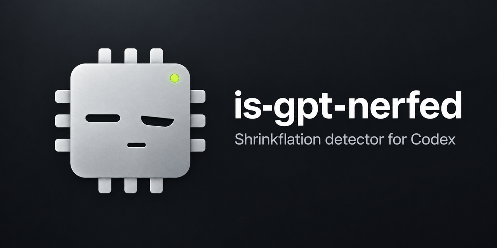
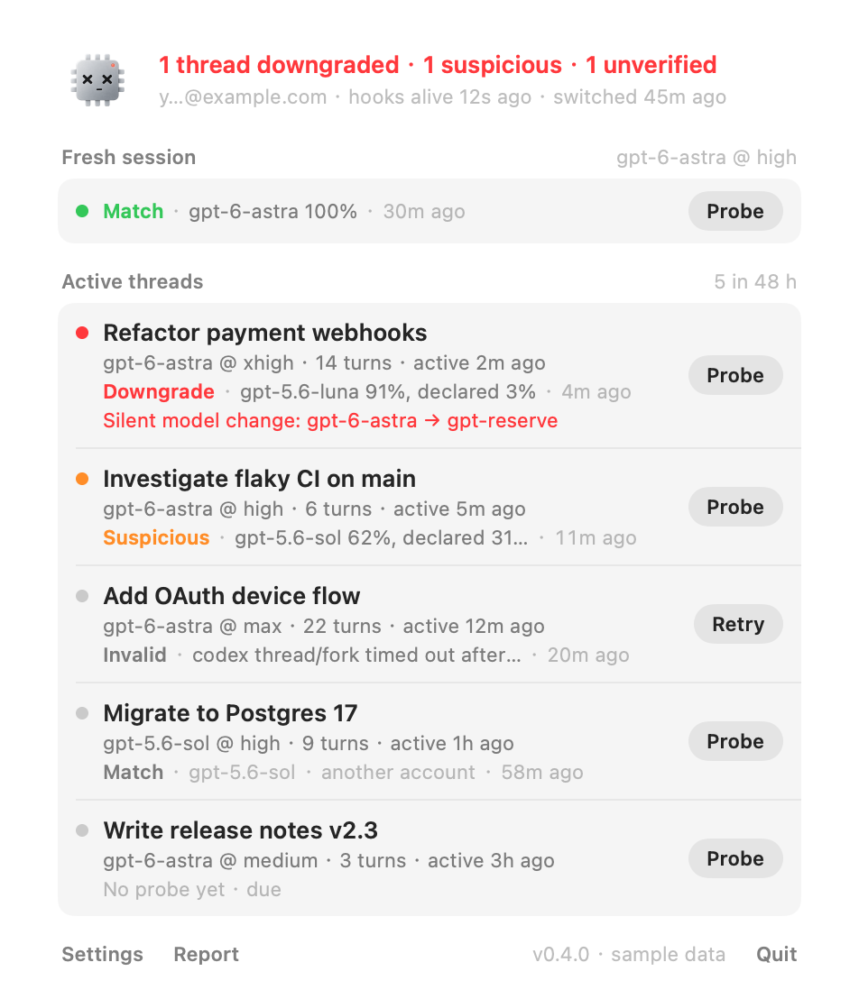
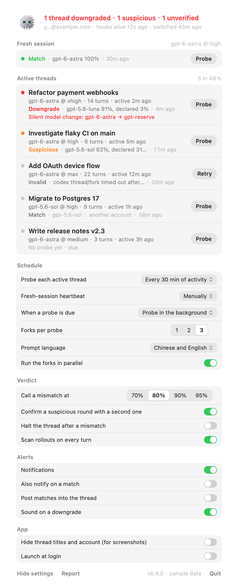
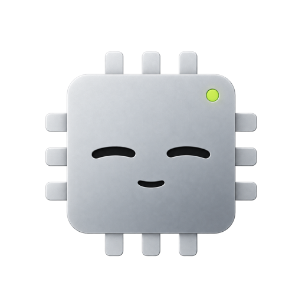
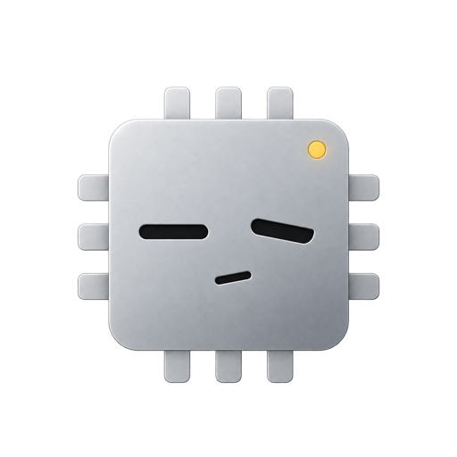
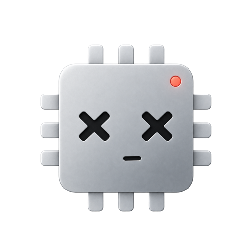

<p align="center"></p>


You pick a model in Codex. This tells you whether that model is actually the one answering, and says so when it isn't:

> 🎉 Congrats! You've been nerfed! You asked for gpt-6-astra; the fingerprint says gpt-5.6-luna (91%). Enjoy the discount you didn't ask for.

<br clear="right">

<p align="center">
  
  
</p>
<p align="center">
    
  <br><sub>All clear · Suspicious · Nerfed</sub>
</p>

## What it checks

Two signals. Everything runs on your Mac; nothing is uploaded.

**Every turn, zero tokens.** Codex records, per turn, which model and reasoning effort it asked for. The plugin
reads that and flags anything that changed without you changing it: a model swap, a reasoning-effort drop, a hidden
internal model (such as `gpt-reserve`), a context window that shrank.

**On a schedule, three forks.** The thread is forked ephemerally three times at its last finished turn, the same
mechanism as `/side`, invisible in Codex. Each fork is asked for about 300 "random" numbers. Models are bad at
random, each in its own way, and [ModelTrace](https://github.com/xqy2006/ModelTrace)'s calibrated bank turns that
into a fingerprint (100 % accuracy with three answers in cross-validation). The verdict compares the fingerprint with
the model you selected:

| verdict | meaning |
| --- | --- |
| Match | the model you selected answered |
| Suspicious | the fingerprint leans elsewhere, not confidently; three more forks run before it is final |
| Downgrade / Upgrade / Rerouted | confident mismatch: top candidate ≥ 80 %, your model ≤ 20 % |
| Downgraded | Codex's own records show a silent switch; no fingerprint needed |
| Unlisted | your model is not in the fingerprint bank yet |
| Invalid | no usable answer (tool use, refusal, network); Retry is offered |

A mismatch reaches you as a macOS notification, a message in the thread, and a red face in the menu bar.
Match is silent.

## Install

**App, macOS 26.** Download the zip from [Releases](https://github.com/kiyoakii/is-gpt-nerfed/releases), move
IsGPTNerfed to Applications, open it (right-click → Open the first time), click the face in the menu bar, press
**Install**. That registers the bundled plugin with Codex and trusts its hooks. Done.

**Without the app, any macOS.**

```bash
git clone https://github.com/kiyoakii/is-gpt-nerfed ~/is-gpt-nerfed && cd ~/is-gpt-nerfed && ./install.sh
```

Say yes when it asks to trust the hooks: Codex runs no hook you have not trusted, and it does not tell you.

Needs Codex 0.117 or newer (desktop app or CLI) and the system `python3`. Uninstall with `./uninstall.sh`.

## Using it

- **Nothing.** Every thread you work in is probed in the background every 8 turns.
- **`$is-gpt-nerfed`** in a thread probes it now. `/side $is-gpt-nerfed` keeps that out of your context.
- **Menu bar.** Threads of the last 48 hours with their last verdict, Probe and Retry per thread, and *Fresh session*:
  what a brand-new session gets right now.
- **Terminal.** `nerfed probe now` (pick a thread), `nerfed report`, `nerfed explain <probe>`, `nerfed log --since 2h`.

Settings live in the app, or `nerfed config set <key> <value>`:

| key | default | |
| --- | --- | --- |
| `frequency` | `turns:8` | per thread: every N turns (`turns:8`) or every N minutes of activity (`30m`) |
| `fresh_frequency` | `manual` | probe a brand-new session every N minutes, whatever you are doing |
| `mode` | `auto` | `auto` probes in the background, `nudge` only reminds you |
| `halt_on_mismatch` | `false` | block tools after a mismatch until you say resume |
| `notify_on_ok`, `announce_ok` | `false` | also report Match |
| `hide_titles` | `false` | screenshot mode: neutral thread names, no account |

## Accounts

Threads are shared between Codex accounts; nerfing may not be. Every probe is tagged with the signed-in account (a
hash, never the id). After you switch accounts, older verdicts show as "another account" and those threads are
probed again.

## Limits

- "The model you selected" is what Codex asked for. If the server swapped weights and kept the name, only the
  fingerprint or a shrinking context window can show it.
- The bank is closed-set: a model outside it is mapped to its nearest look-alike.
- A probe costs three short answers on your account, six when the first round is Suspicious.
- The forks run through a private connection to Codex's app-server. If routing depended on the desktop app's own
  connection, `/side $is-gpt-nerfed` inside Codex would be the truer test.

## Privacy

Reads `~/.codex` (thread records, models cache; `auth.json` only for an account hash and a masked e-mail). Writes
`~/.codex/is-gpt-nerfed` (probes, verdicts, `log.jsonl`). Makes no network requests of its own; the forks are
ordinary Codex inference under your account.

## Credits

[ModelTrace](https://github.com/xqy2006/ModelTrace) (xqy2006, MIT) for the fingerprint bank, scorer, prompts and the
fork-and-verify sequence; [hlwy-ai-checker](https://github.com/hanlinwenyuan/hlwy-ai-checker) for the random-number
idea; [simple-term-menu](https://github.com/IngoMeyer441/simple-term-menu) (MIT) for the thread picker.

MIT license. Internals, build and contribution notes: [docs/DEVELOPMENT.md](docs/DEVELOPMENT.md).
