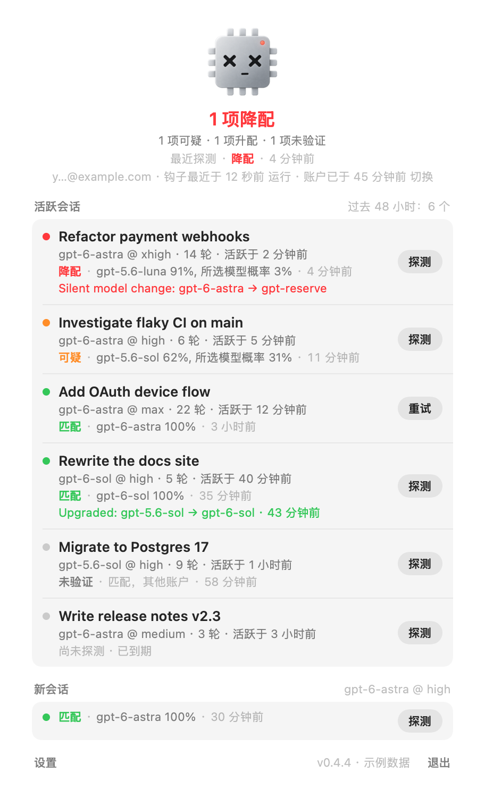
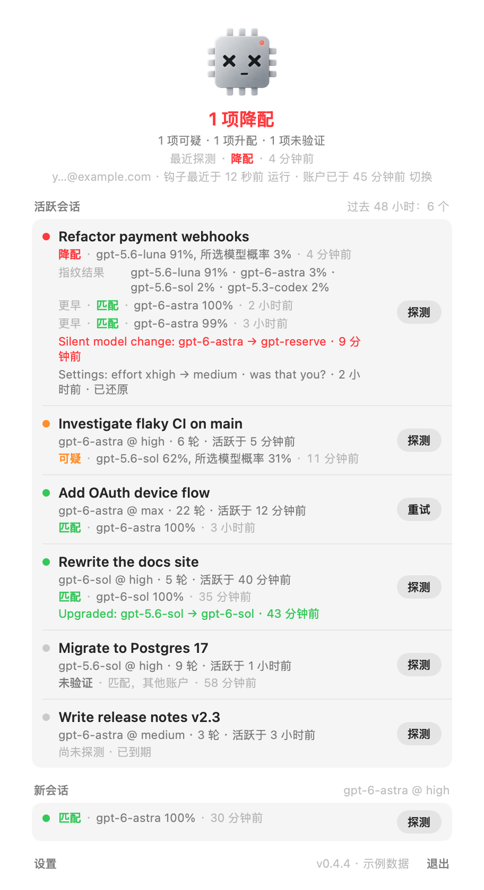

<p align="center"></p>

[English](README.md) · 简体中文

你在 Codex 里选了一个模型，这个工具帮你检查实际回答的是否就是它。如果不是，你会看到这样的提示：

<p align="center">
  
  <br>🎉 恭喜，你被降配了！你选的是 gpt-6-astra，指纹识别出的却是 gpt-5.6-luna（91%）。这份未经同意的缩水，请收好。
  <br><sub>输出示例，并非真实检测结果。</sub>
</p>

<p align="center">
  
  
  <br><sub>中文面板和展开后的会话。图中为示例数据，并非真实会话；会话标题和原始证据保留原文。</sub>
</p>
<p align="center">
    
  <br><sub>正常 · 可疑 · 已降配</sub>
</p>

## 检查什么

记录分析和指纹比对在你的 Mac 上完成，不上传本地检测记录；主动探测会通过你的 Codex 账户请求模型回答。

Codex 会逐轮记录它请求的模型和推理强度。插件在每轮结束后读取记录，标记未经你操作的变化：更换模型、降低推理强度、使用 `gpt-reserve` 等隐藏内部模型，或缩小上下文窗口。如果切换到更新或更大的模型，也会报告。这部分检查不消耗 token。

插件还会定期通过桌面端创建侧边会话所用的 app-server 调用，将你的会话临时分叉三次，沿用该会话的模型和推理强度。每个分叉会被要求生成约 300 个“随机”数字。语言模型选取随机数字时会表现出自身特有的偏差。[ModelTrace](https://github.com/xqy2006/ModelTrace) 的校准指纹库会将这三份回答转换为模型指纹（其交叉验证中，使用三份回答的准确率为 100%），再与所选模型比较：

| 结果 | 含义 |
| --- | --- |
| 匹配（Match） | 回答来自你所选的模型 |
| 可疑（Suspicious） | 指纹更倾向于其他模型，但置信度不足；保留此结果直到下一次探测 |
| 降配 / 升配 / 已改道（Downgrade / Upgrade / Rerouted） | 高置信度的不匹配：第一候选概率至少 80%，所选模型概率不超过 20%，且至少取得两份回答 |
| 已降配（Downgraded） | Codex 自身记录显示发生了静默切换，无需指纹判断 |
| 已升配（Upgraded） | Codex 自身记录显示切换到了更新或更大的模型 |
| 未收录（Unlisted） | 指纹库尚未收录你所选的模型 |
| 无效（Invalid） | 没有可用回答（例如工具调用、拒答或网络问题）；不构成判断，界面保留上次结果并提供重试 |

发现不匹配时，工具会通过 macOS 通知、会话消息和菜单栏红色表情提醒你。默认不通知匹配结果。

## 安装

应用需要 macOS 26。在终端执行这一行即可安装并打开最新发布版：

```bash
curl -fsSL https://raw.githubusercontent.com/kiyoakii/is-gpt-nerfed/main/install-app.sh | sh
```

也可以从 [Releases](https://github.com/kiyoakii/is-gpt-nerfed/releases) 下载磁盘映像，将 IsGPTNerfed 拖入“应用程序”。应用尚未完成 Apple 公证，首次启动被 macOS 拦截时，需要在“系统设置 → 隐私与安全性”中允许打开。

点击菜单栏表情，再点击 **安装（Install）**，即可将应用内置插件注册到 Codex 并信任其 hooks。发布新版本后，面板底部会显示提示，并发送一次通知；点击后，应用会下载新版本、校验文件、替换自身并重新启动。

如果不使用应用，可在 macOS 上仅安装插件：

```bash
git clone https://github.com/kiyoakii/is-gpt-nerfed ~/is-gpt-nerfed && cd ~/is-gpt-nerfed && ./install.sh
```

询问信任 hooks 时请选择同意。Codex 不会运行尚未信任的 hook，也不会提醒你它被跳过。

需要支持插件 hooks 的 Codex（桌面端或 CLI，已在 0.154 上测试）和系统 `python3`。运行 `./uninstall.sh` 可卸载。

## 使用

macOS 界面支持英语和简体中文，跟随系统首选语言，未支持的语言回退到英语。CLI 输出、通知、复制出的报告和原始诊断证据保留英文。界面语言不会改变 ModelTrace 已校准的探测提示词。此说明对应当前源码；发布版的支持情况以其包含的代码为准。

你正在使用的每个会话，累计活跃 30 分钟后会在后台接受探测。要立即探测某个会话，在其中输入 `$is-gpt-nerfed`。

菜单栏面板列出过去 48 小时的会话及最近一次结果。点击会话可展开报告（指纹、历史探测、证据），右键可打开操作菜单。每个会话都有探测或重试操作；“新会话”一栏会探测一个没有历史记录的全新会话，查看新会话当前实际获得的模型。

终端命令：`nerfed probe now`（选择会话）、`nerfed report`、`nerfed explain <probe>`、`nerfed log --since 2h`。

可在应用中修改设置，也可以使用 `nerfed config set <key> <value>`：

| 配置项 | 默认值 | 含义 |
| --- | --- | --- |
| `frequency` | `30m` | 每个会话累计活跃 N 分钟（如 `30m`）或每 N 轮（如 `turns:8`）探测一次 |
| `fresh_frequency` | `manual` | 不受当前活动影响，每 N 分钟探测一次全新会话 |
| `mode` | `auto` | `auto` 在后台探测，`nudge` 仅提醒 |
| `halt_on_mismatch` | `false` | 检测到不匹配后阻止工具调用，直到你要求恢复 |
| `notify_on_ok`, `announce_ok` | `false` | 也通知或在会话中报告匹配结果 |
| `hide_titles` | `false` | 截图模式：使用中性会话名称，隐藏账户 |
| `check_updates` | `true` | 每 10 分钟向 GitHub 检查一次新版本 |

## 账户

不同 Codex 账户共享会话，但降配可能与账户有关。因此每次探测都会标记当时登录的账户（仅保存哈希，不保存账户 ID）。切换账户后，旧结果会显示为“其他账户”，这些会话也会重新接受探测。

## 局限

- “你所选的模型”指 Codex 实际请求的模型。如果服务端替换了模型权重却保留原名称，只有指纹或上下文窗口缩小可能揭示这种变化。
- 指纹库是封闭集合：库外模型会被映射到库内最相近的模型。
- 一次探测消耗你账户下的三次简短回答。分叉超过五分钟未回答时，会补建一次，避免较慢的模型缺失样本。
- 通过 Codex 自身设置修改模型或推理强度时，工具会询问“是你改的吗？”，因为它无法区分是你还是 Codex 做了修改。
- 探测运行于独立的 app-server 进程，并将客户端身份设为所检查的客户端（桌面端或 CLI），因为服务端可能按客户端分配模型。桌面端自身连接与探测连接之间的其他差异，工具无法观察。

## 隐私

插件读取 `~/.codex`（会话记录、模型缓存，以及 `auth.json` 中用于生成账户哈希和脱敏邮箱的信息），并写入 `~/.codex/is-gpt-nerfed`（探测记录、结果、`log.jsonl`）。临时分叉使用你的账户进行普通 Codex 推理。应用打开时，自行发起的版本检查每 10 分钟向 GitHub 请求一次最新发布标签；在设置中关闭更新检查即可停止这些请求。

## 致谢

[ModelTrace](https://github.com/xqy2006/ModelTrace)（xqy2006，MIT）提供指纹库、评分器、提示词及分叉验证流程；[hlwy-ai-checker](https://github.com/hanlinwenyuan/hlwy-ai-checker) 提供随机数字识别思路；[simple-term-menu](https://github.com/IngoMeyer441/simple-term-menu)（MIT）提供会话选择器。

采用 MIT 许可证。内部原理、构建与贡献说明见 [docs/DEVELOPMENT.md](docs/DEVELOPMENT.md)（英文）。
